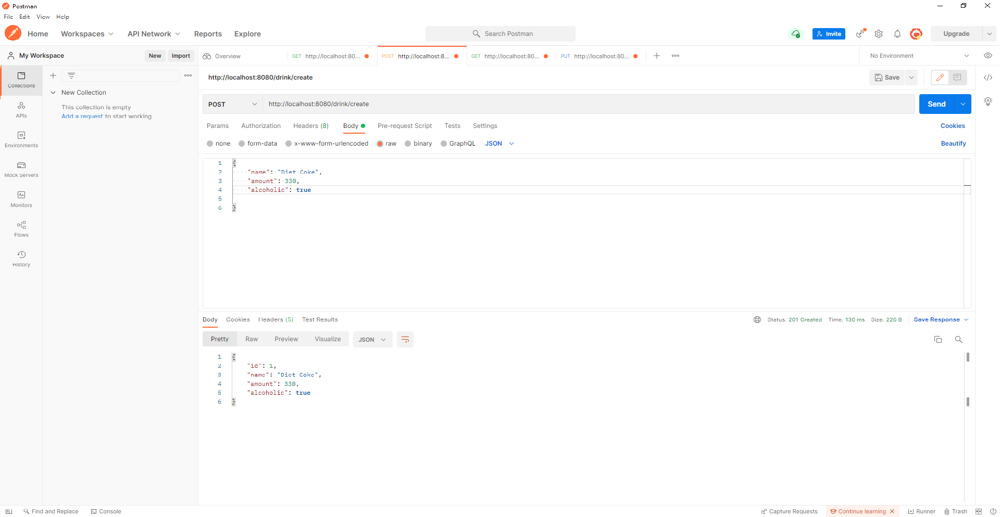
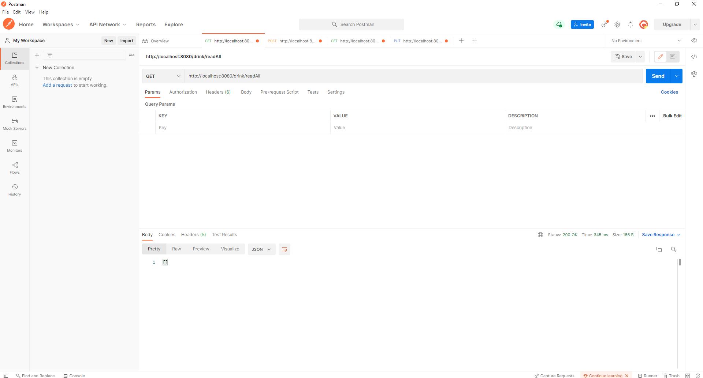
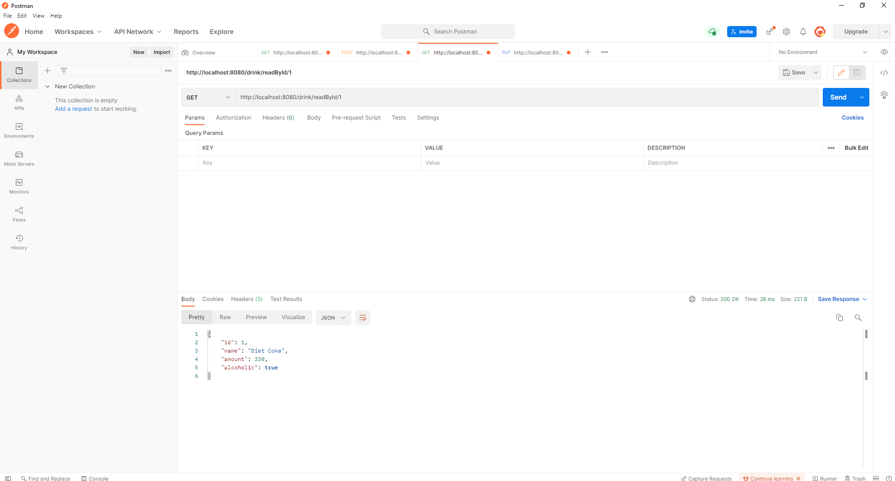
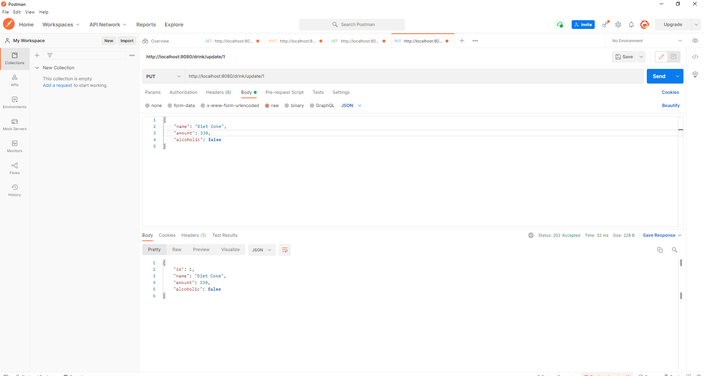
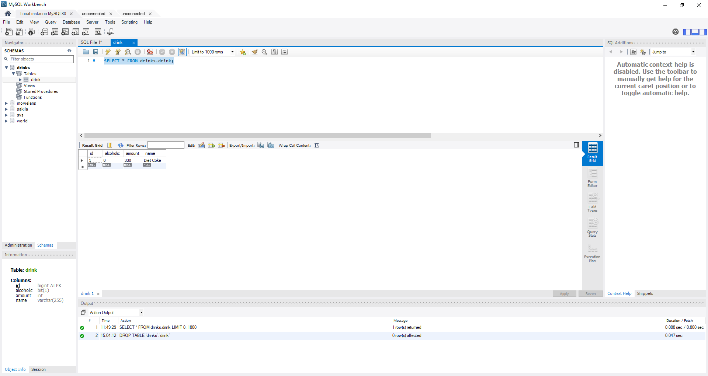

# SpringDrinksProject
Why are we doing this?
- To create an API for managing drinks

How I expected the challenge to go.
- I expected it to be challenging

What went well? / What didn't go as planned?
- All tests work but I did not manage to get full coverage 

Possible improvements for future revisions of the project.
- Add more methods and fields
- Add more tests

Screenshots showing your postman requests and the output from the API.

Screenshots of your database to prove that data is being persisted.

